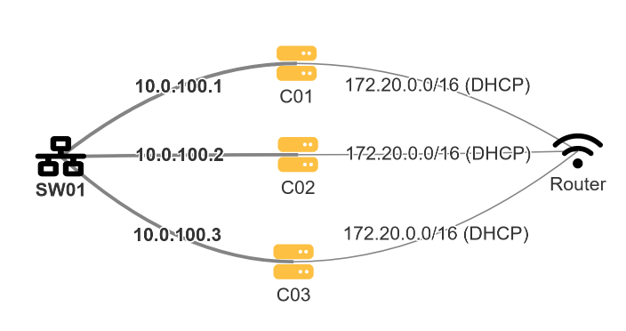

# 3-Node Proxmox Cluster
wq## ! UNDER CONSTRUCTION !
### Project Overview
My goal for this project is to build a Cluster of *Proxmox Hypervisors* that will allow me to run future projects on top of. This project will allow me to get my hands dirty with *virtualization* and apply some of my *Computer Networking* knowledge to set up a secure network topology that will allow me to "safely" host a variety of services to the public internet. For now, however, my plan is to only expose these services via a *Cloudflare Tunnel*.

For hardware, I limited myself to only spend $100, and I was able to find a good deal on 3 Lenovo ThinkCenter M73 machines, each with an Intel Core i3-4130T @ 2.9GHz with 8GB of RAM and a 256GB SATA SSD. While the i3 processors are limiting, I plan on upgrading them (perhaps with i5-4590Ts) when the need arises. 

### Limitations
At my current residence, I do not have control over the network settings, including assigning static IPs or port-forwarding, and am limited to a wireless connection. My temporary solution is to use a direct connection via a statically-assigned private subnet operating over a switch, the same one that will be used for each Proxmox node to talk to each other.

This of course leaves the WAN to deal with. There are really only two other ways for me to get each node online, either by creating a network bridge on my desktop and using a Router with NAT, or enable the wireless NICs on each of my nodes. I initially attempted the first option, and while it worked temporarily I found that I had issues with getting a reliable DNS connection.

